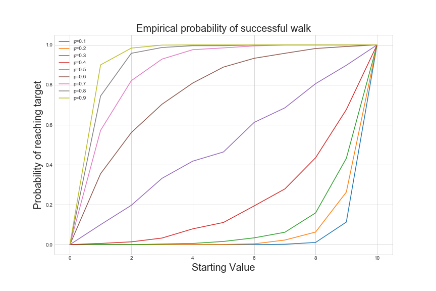
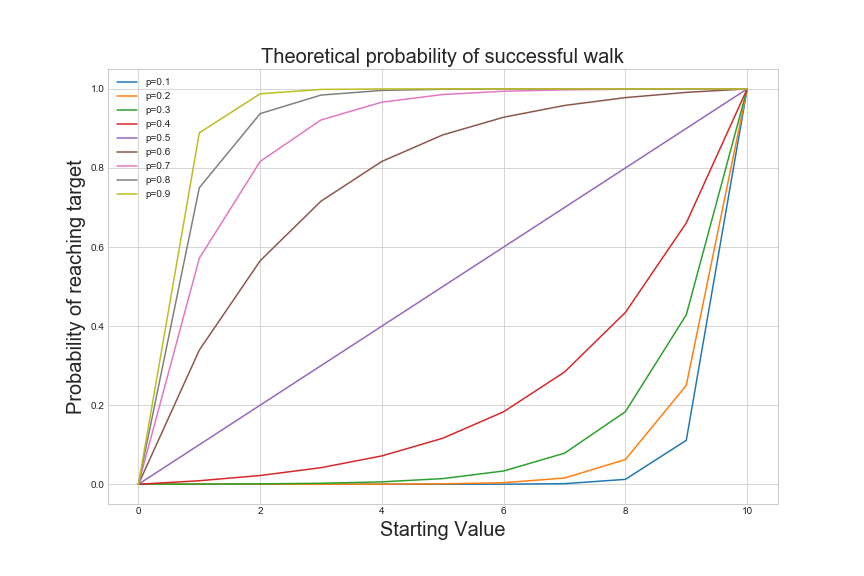

# Introduction 

Random walks are an essential stochastic process with applications from physics to financial modeling. In this post, I'll examine a simple example of the random walk - a special case of the game known as **gambler's ruin**. 

## Setup 

### Simple Symmetric Random Walk

Suppose we have a sequence of independent, identically distributed random variables $X_1, X_2, ..., X_n, ...$ which are $1$ with probability $p$ and $-1$ with probability $1 - p$. That is, 

$$\forall i [P(X_{i} = k)] = 
\begin{cases}
p & k = 1 \\
1 - p & k = -1 \\
0 & \text{otherwise}
\end{cases}$$

Then, let $S_{0} = 0$ and $$S_{n} = \sum\limits_{i = 1}^{n} X_{i}$$ 

The sequence of random variables $(S_{n})_{n = 1}^{\infty}$ is a **simple symmetric random walk.**

### Gambler's Ruin 

Next, let's define a special case of [gambler's ruin](http://mathworld.wolfram.com/GamblersRuin.html). 

**Game**: Suppose a gambler is playing a game of chance. He starts with $x$ for some $0 < x < k$. At each round, he flips a biased coin with $P(\text{HEADS}) = p$. If the coin is heads, he gains $1$. If it is tails, he loses $1$. The game continues until he loses all his money, ending up with $0$, or attains $k$. The former outcome is a *loss* and the latter is a *win*.

**Question**: Suppose that we start at 1, and at each step we go to +1 with probability $p$ and -1 with probability $1 - p$. What is the probability that we get to $k$? 

## Gathering Data

If you can pull fully formed theorems and proofs out of a hat, I applaud you. I like to gather some simple data to formulate a guess. Le'ts write a simple script. 

```python
import numpy as np 
import matplotlib.pyplot as plt 
%matplotlib inline 
import seaborn as sns 
sns.set_style('whitegrid')

def walk_to_end(start_val, upper_limit, lower_limit = 0, p = 0.5): 
    '''
    Plays the gambling game described above until done. 
    start_val: Initial number of dollars
    upper_limit: Target number of dollars. Value at which game is won.
    lower_limit: Value at which game is lost.
    p: Probability of +1 at a step. 
    '''
    current_val = start_val
    num_trials = 0
    while current_val > lower_limit and current_val < upper_limit: 
        trial = np.random.binomial(1, p)
        if trial > 0: 
            current_val += 1
        else: 
            current_val -= 1
        num_trials += 1
    return num_trials, current_val == upper_limit

def empirical_success_estimator(num_runs, start_val, upper_limit, lower_limit = 0, p = 0.5):
    '''
    Estimates the probability of success in the gambling game, 
    averaged over a number of trials. 
    num_runs: Number of times the game is played.
    start_val: Initial number of dollars
    upper_limit: Target number of dollars. Value at which game is won.
    lower_limit: Value at which game is lost.
    p: Probability of +1 at a step. 
    '''
    num_success = 0 
    for _ in range(num_runs): 
        num_steps, success = walk_to_end(start_val, upper_limit, lower_limit, p)
        if success: 
            num_success += 1
    return num_success/num_runs
```

Next, let's plot the empirical probability of a "successful walk" for $p \in [0.1, 0.2, ..., 0.9]$ and $x \in \{0, 1, ..., 10\}$ where $k = 10$.

```python
plt.figure(figsize=(12, 8))
for p in np.arange(0.1, 1, step=0.1):
    p_success_vals = []
    for i in range(0, 11): 
        p_success = empirical_success_estimator(1000, i, 10, 0, p)
        p_success_vals.append(p_success)
    plt.plot(np.arange(0, 11), p_success_vals, label='p={}'.format(np.round(p, decimals=1)))
plt.legend()
plt.xlabel('Starting Value', fontsize=20)
plt.ylabel('Probability of reaching target', fontsize=20)
plt.title('Empirical probability of successful walk', fontsize=20)
plt.savefig('empirical_probability.png')
```



As you might have expected, this onion-like shape is too symmetric and clean to look coincidental. In particular, it seems symmetric about the purple diagonal line in the center, and the slopes seem to increase non-linearly for all $p$ except $p = 0.5$. What's going on here? 

## Theoretical Verification 

This raises the question - What is the probability of success in our game, where 

$$p = P(HEADS)$$ 

$$x := \text{Starting Value}$$

$$k := \text{Winning Value}$$

Well, with motivation done, I think it's time for me to pull a theorem out of a hat. 

**Theorem**: When the gambler starts with $x$ dollars, with the stopping conditions of *loss* at $0$ and *win* at $k$, and the probability of HEADS is $p$, the probability of winning $f_{k}(x)$ is 

$$f_{k}(x) = \begin{cases}
\frac{(\frac{1 - p}{p})^{x} - 1}{(\frac{1 - p}{p})^{k} - 1} & p \neq 0.5 \\
\frac{x}{k} & p = 0.5 \end{cases}$$

**Proof**: We know that $f_{k}(k) = 1$ and $f_{k}(0) = 0$. We proceed in cases: 

(i) $p \neq 0.5$. If $0 < x < k$, then after 1 step the gambler has $x + 1$ with probability $p$ and $x - 1$ with probability $1 - p$. Therefore, $f_{k}(x) = pf_{k}(x + 1) + (1 - p)f_{k}(x-1)$. To solve, we can solve the characteristic equation $y = py^2 + (1-p)$. 

$$\begin{eqnarray} 
y = py^2 + (1-p) \\ 
y^2 - \frac{y}{p} + \frac{1-p}{p} = 0 \\
y = \frac{\frac{1}{p} \pm \sqrt{\frac{1}{p^2} - \frac{4-4p}{p}}}{2} &\text{Quadratic Formula}\\ 
= 1, \frac{1 - p}{p}
\end{eqnarray}$$

So the original equation becomes $f_{k}(x) = a(1)^{x} + b(\frac{1 - p}{p})^{x}$. We therefore have a system of equations in two variables $a, b$. 

$$\begin{eqnarray}
f_{k}(x) = a + b(\frac{1 - p}{p})^{x} \\
f_{k}(k) = a + b(\frac{1 - p}{p})^{k} = 1 \\
f_{k}(0) = a + b = 0 
\end{eqnarray}
$$

Solving this system gives the desired result of $f_{k}(x) = \frac{(\frac{1 - p}{p})^{x} - 1}{(\frac{1 - p}{p})^{k} - 1}$, when $p \neq 0.5$.  

(ii) $p = 0.5$. In this simpler case, [first step analysis](http://www.maths.qmul.ac.uk/~ig/MAS338/FSA-example.pdf) will suffice. Notice that for $0 < x < k$, $f_{k}(x) = 0.5 f_{k}(x-1) + 0.5 f_k(x+1)$. Combining with $f_{k}(1) = 0.5 f_k(0) + 0.5 f_k(2) = 0.5 f_k(2)$ and $f_k(9) = 0.5 f_k(10) + 0.5 f_k(8) = 0.5 + 0.5 f_k(8)$ gives the desired result. 

### Plotting Theoretical Probability

If we plot the theoretical probability of a win that's given by this theorem, we get what looks like a "smoothed out" version of the empirical estimate.

```python
def fkx(start_val, upper_limit, p = 0.5):
    '''
    Theoretical probabilit of winning the gambling game,
    with lower limit 0.  
    start_val: Initial number of dollars
    upper_limit: Target number of dollars. Value at which game is won.
    p: Probability of +1 at a step. 
    '''
    x = start_val
    k = upper_limit
    if(p == 0.5):
        return (x/k)
    else: 
        return (((1 - p)/p)**x - 1)/(((1 - p)/p)**k - 1)

plt.figure(figsize=(12, 8))
for p in np.arange(0.1, 1, step=0.1):
    p_success_vals = []
    for i in range(0, 11): 
        p_success = fkx(p, 10, i)
        p_success_vals.append(p_success)
    plt.plot(np.arange(0, 11), p_success_vals, label='p={}'.format(np.round(p, decimals=1)))
plt.legend()
plt.xlabel('Starting Value', fontsize=20)
plt.ylabel('Probability of reaching target', fontsize=20)
plt.title('Theoretical probability of successful walk', fontsize=20)
plt.savefig('theoretical_probability.png')
```



## What's going on here? 

With empirical and theoretical results in hand, let's ask again: what's going on here? 

I think the first step analysis from the theorem proof sheds some light here. When $p = 0.5$, win probability scales linearly with starting position. The closer you start to a win or loss, the more likely you end up there. Nothing surprising. 

But for a value of $p$ that is even slightly biased towards win or loss (that is, slightly different from $p = 0.5$) we get an exponential increase/decrease in overall win rate. First step analysis tells us that for $1 < x < k - 1$, that 

$$f_k(x) = (1-p)^2 f_k(x - 2) + 2p(1-p) f_k(x) + p^2 f_k(x + 2)$$

Of course, we can get similar equations for an arbitrary number of steps. The point is that as the exponents for the coefficents grow, the bias of the coin gets amplified. This phenomenon of "amplification of bias" is really an instance of the [ergodic theorem for Markov chains](http://www.math.uchicago.edu/~may/VIGRE/VIGRE2007/REUPapers/FINALFULL/Casarotto.pdf).
