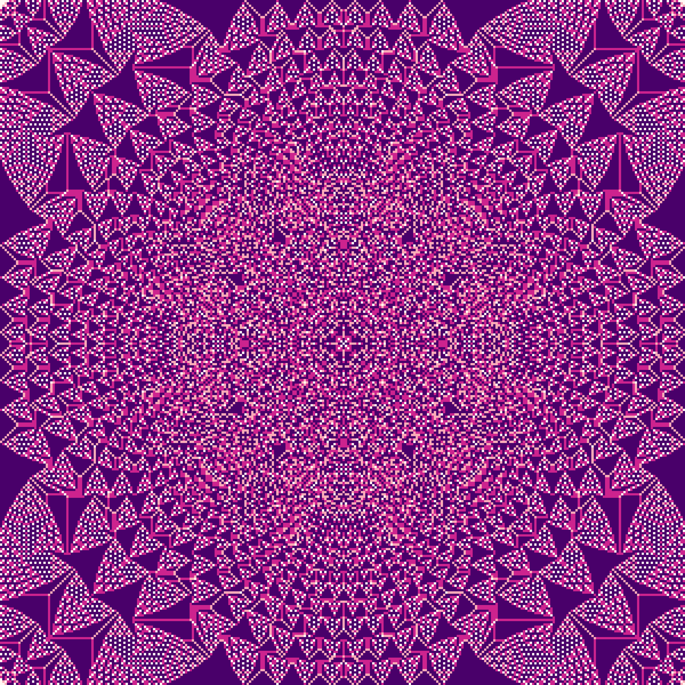
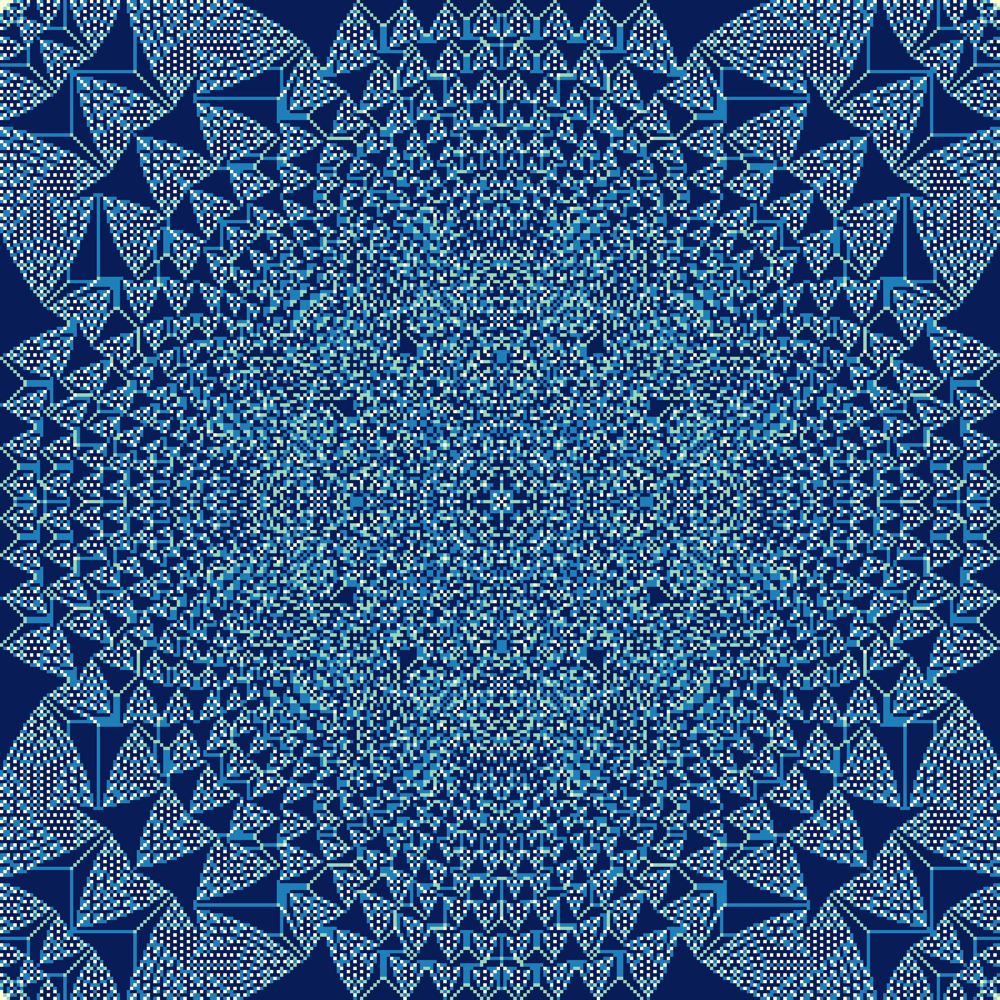
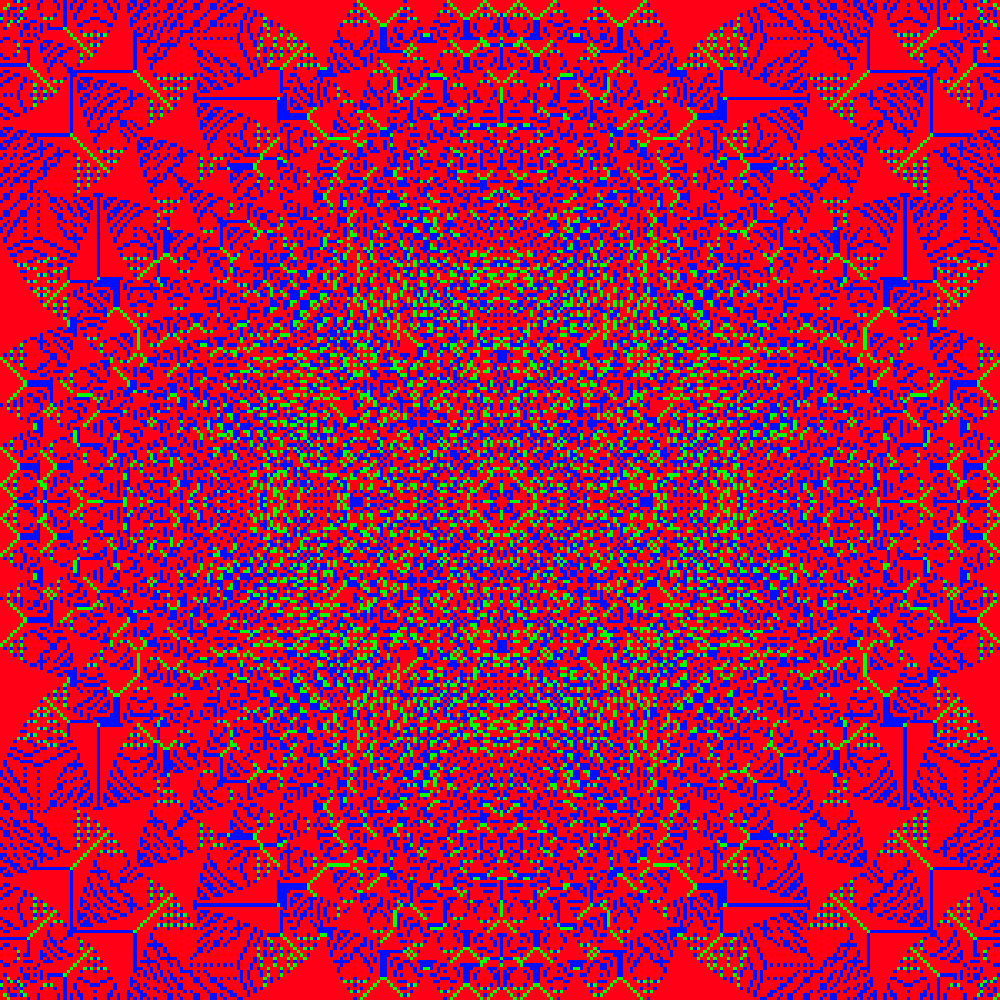

I finally got around to uploading my [bachelor's thesis on abelian sandpiles](files/akhil_thesis_sandpile_group.pdf), which I finished all the way back in May. In a nutshell, I tried to understand the sandpile group of certain interesting families of graphs, through some machinery called the Smith Normal Form of the graph Laplacian matrix. Every finite abelian group, including the sandpile group of a finite undirected graph, is the direct sum of some finite cylic groups of the form $\mathbb{Z}/n \mathbb{Z}$. The values of $n$ for these cylic groups are called the invariant factors of the sandpile group, and they characterize the sandpile group (in fact, every finite abelian group), up to isomorphism. The diagonal entries of the Smith Normal Form, as it turns out, give exactly the invariant factors of the sandpile group. So we can reduce the study of the sandpile group to the study of this form of the reduced Laplacian matrix. To summarize, 

$$\begin{eqnarray}
\textrm{Graph } G \rightarrow \text{Reduced Laplacian Matrix } \Delta_G^\prime \\
\rightarrow \text{Smith Normal Form } S \\
\rightarrow \text{Diagonal entries } s_1, ..., s_{n-1} \\
\rightarrow \text{Sandpile group } \bigoplus\limits_{i=1}^{n-1} \mathbb{Z}/s_i \mathbb{Z}$$

Given that I finished this in May, why did it take me so long to upload it? Essentially, I was under the delusion that I would brush it up, fill out the missing proofs, fix up the typos...basically, keep working on it until it was perfect. This of course will never happen, so I decided to upload the darn thing already, warts and all. 

While rereading it, I realized that my thesis does not do a good job of exciting the reader about sandpiles. In fact, it is rather dry, with no figures until the experimental results at the very end. However, sandpiles are visually fascinating and rich even in simple, computer-generated cases. So I decided to try to recreate the kinds of images that got me excited about sandpiles almost a year ago. Here's one. 

Here are some more images, which have the same data but a different color scheme. Which one is your favorite? 

Okay, so what is this thing? This is, as you might guess, a sandpile. Specifically, it is the stabilization of the sandpile on $\mathbb{Z}^2$, with an initial configuration of $10^6$ grains at the origin and zero grains everywhere else. 

As you can tell, there is quite a lot of symmetry and fractal structure going on here. This image is begging for some mathematical explanation. However, researchers have not completely resolved questions about even this simple sandpile - see Conjecture 6.2 in [this paper](https://arxiv.org/abs/0801.3306). 

What *is* a sanpile? Well, a sandpile is just a graph $G = (V, E)$ with a function $s: V \rightarrow \mathbb{Z}$, where the function $s$ assigns some integer number of "grains of sand" to each vertex of the graph. In this case, our graph has vertex set $\mathbb{Z}^2$ with edges according "up, down, left, right" - that is, each vertex $(x, y)$ is neighbors with $(x \pm 1, y), (x, y \pm 1)$. 

A *stabilization* of a sandpile is the unique configuration $s^\*: V \rightarrow \mathbb{Z}$ which results from arbitrarily firing vertices of the sandpile until no vertex can fire any more. 

What is firing? Well, at this point I should really beg off and ask you to read my [thesis](https://akhiljalan.github.io/files/akhil_thesis_sandpile_group.pdf) - or, at least, some of the other excellent work on sandpiles, such as this [survey article](https://arxiv.org/abs/0801.3306). 
