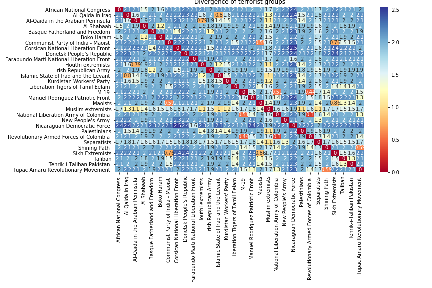
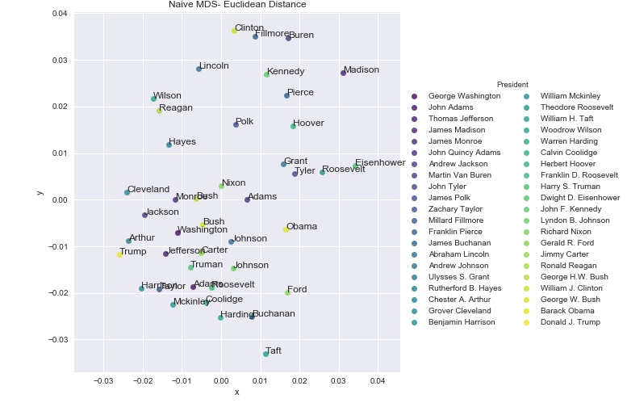
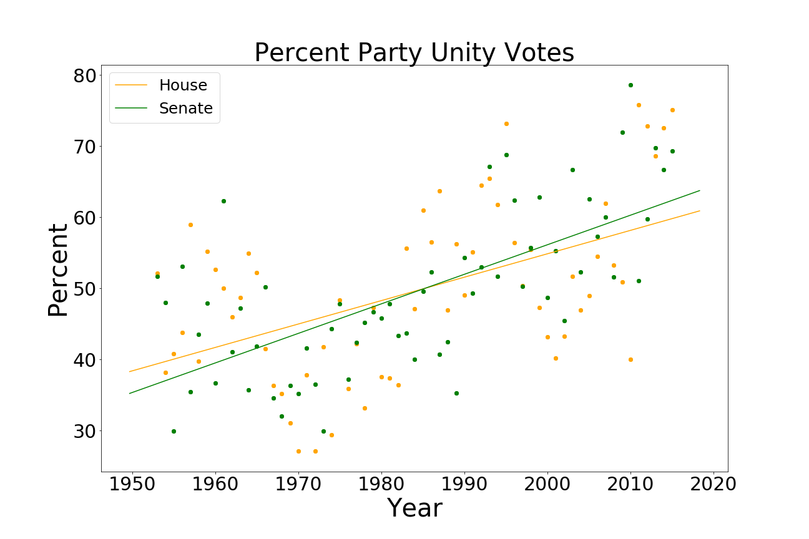

# Machine Learning for Counterterrorism

Team: Akhil Jalan, Yakub Akhmerov, Paul Kim

Link: See the [Github repo](https://github.com/berkeley-stat159-f17/project-3-p2-ak-ja-zh/blob/master/main.ipynb)

In this project, my team and I sought to build a classifier to predict the success or failure of a terrorist attack. In addition to building three different classifiers (random forests, neural networks, and LASSO regression), we created map GPS visualizations (credit to Yakub) and heatmaps to roughly quantify similarity of terrorist networks, attack types, and region. 

This was my captsone project for a class in Fall 2017 (Statistics 159).

---

# Analysis of State of the Union Speeches

Team: Akhil Jalan, Yakub Akhmerov, Ken Zhong 

In this project, my team created a bag-of-words model and K-nearest-neighbors to analyze Presidential state of the union speeches. After forming all of the stemmed words across speeches as a "dictionary", each President was modeled as a vector whose entries were the number of times some word was used. 

In addition to creating a visualization of this high-dimensional vector space using multidimensional scaling to project to 2 dimensions (credit to Yakub), built a K-nearest-neighbors classifier whose training set was some subset of all presidential speeches, and test set was other speeches. While this approach was fairly naive, we got an accuracy of 76% with $k = 1$. 

---

# Political Partisanship: A Look at the Data

Team: Solo

Link: See the [Github repo](https://github.com/akhiljalan/politics-nerdfest). 

This was for an [article](https://towardsdatascience.com/political-partisanship-a-look-at-the-data-e71946199586) in [Towards Data Science](https://towardsdatascience.com/). Using [Brookings’ Vital Statistics on Congress](https://www.brookings.edu/multi-chapter-report/vital-statistics-on-congress/), and in particular the subset of the data containing [Poole-Rosenthal DW-NOMINATE](https://voteview.com/) scores for partisan ideology in Congress, I examined data from Congressional party vote unity and ideological score differences from 1953 to 2015. 

Using a two-sided t-test, I concluded that the two parties have diverged ideologically since 1953 - from a 0.4 score difference then to almost 0.8 now in both chambers of Congress. 

