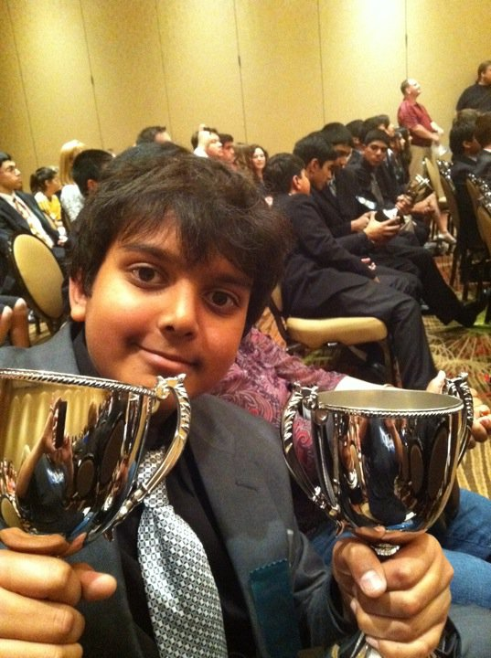

# About 

### Brief Story of My Life

I grew up in Southern California, where I spent a lot of time playing YuGiOh and re-reading the Harry Potter books (still a huge Potterhead). 

From ages 12-18, I spent a lot time in competitive debate, which I consider a formative influence. Debate taught me to appreciate complexity, question everything, and speak articulately. 

Here's a picture of me holding some debate trophies and looking quite satisfied, taken in 2011. 

{:height="50%" width="50%"}

Having learned a bit about world events, I came to Cal in 2015 intending to major in Economics or Political Science. But during first semester, I ended up enjoying the math class I took (an introduction to linear algebra and differential equations) so much that I decided to study applied math instead. From there, my curiosity led me into classes in programming, algorithms, statistics, and machine learning. Now, here I am. 

Besides learning a ton in my classes, I've made some great friends and memories in [Effective Altruists of Berkeley](https://www.facebook.com/effectivealtruismberkeley/), a student club about [effective altruism](https://www.effectivealtruism.org/). I've been President of EAB since January 2017. 